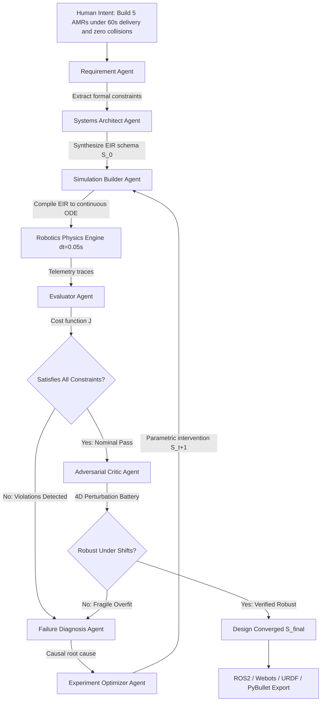
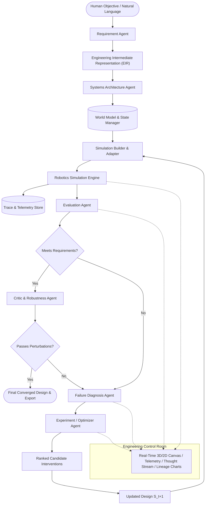

# SimWeaver: Autonomous Multi-Agent Robotics Simulation Engineer

SimWeaver is an autonomous simulation engineering system designed to bridge natural language human engineering intent and formal, physically verified robotics simulation environments. Rather than simply generating static simulator code from a prompt, SimWeaver conducts the complete iterative engineering lifecycle: it translates natural language requirements into an Executable Intermediate Representation (EIR), builds continuous physics and kinematic multi-robot simulations, evaluates telemetry against strict quantitative constraints, diagnoses root causes of failures, formulates and ranks candidate interventions, subjects candidates to adversarial perturbation testing via a Critic agent, and iterates autonomously until all constraints are satisfied.



---

## 1. Core Architecture

SimWeaver is structured around a decoupled, simulator-independent architecture. Agents reason over high-level robotics concepts in the **Engineering Intermediate Representation (EIR)**, while deterministic execution engines perform simulation, physics integration, raycasting, and metric calculation.



---

## 2. Multi-Agent Reasoning Loop

SimWeaver coordinates 7 specialized agent roles:

| Agent | Core Responsibility | Input | Output |
|---|---|---|---|
| **Requirement Agent** | Parses natural language into formal constraints, objectives, and metric targets | User Prompt | Structured Constraints & Objectives |
| **Systems Architect** | Selects initial AMR morphology, sensor suite, planner, and coordination stack | Requirements | Initial Design $S_0$ + Rationale |
| **Simulation Builder** | Compiles EIR into executable continuous simulation instances | EIR Design $S_t$ | Physics Simulation Environment |
| **Evaluation Agent** | Synthesizes telemetry traces into standardized KPI verification tables | Simulation Traces | Target vs Actual Metrics Table |
| **Failure Diagnosis Agent** | Causal trace analysis to isolate bottlenecks and collision hot-spots | Collision & Near-Miss Traces | Causal Diagnosis Hypothesis |
| **Experiment Optimizer** | Generates, predicts trade-offs, and ranks candidate engineering interventions | Diagnosis + Lineage | Ranked Interventions + Design $S_{t+1}$ |
| **Adversarial Critic** | Stress-tests designs against environmental perturbations to prevent overfitting | Nominal Solution | Robustness Index (0 to 100%) |

### Multi-Objective Optimization Formulation

The Experiment Optimizer ranks candidate modifications using a multi-objective cost function $J$:

$$J(S_t) = w_c \cdot C + w_t \cdot \bar{T} + w_r \cdot (1 - R) + w_s \cdot \max(0, d_{\text{safe}} - d_{\text{min}})$$

Where:
- $C$: Collision count ($w_c = 100.0$)
- $\bar{T}$: Average package delivery time in seconds ($w_t = 0.05$)
- $R$: Task completion rate ($w_r = 10.0$)
- $d_{\text{safe}} - d_{\text{min}}$: Safety separation deficit ($w_s = 20.0$)

---

## 3. Engineering Intermediate Representation (EIR)

The EIR is a typed, simulator-independent representation encompassing all aspects of the robotics problem:

```yaml
id: eir_iter_2
version: 1.0.0
iteration: 2
name: SimWeaver Warehouse System Design
human_intent: Warehouse multi-robot delivery with zero collisions and high throughput.

environment:
  name: Warehouse Standard
  width: 24.0
  height: 16.0
  grid_resolution: 0.25
  aisle_width: 2.0

robot:
  type: differential_drive
  count: 5
  radius: 0.28
  wheel_base: 0.40
  mass: 25.0
  max_linear_speed: 1.2
  max_angular_speed: 2.0
  max_linear_accel: 1.5
  max_angular_accel: 3.0

sensors:
  lidar_enabled: true
  lidar_range: 8.0
  lidar_fov_deg: 360.0
  lidar_rays: 720
  lidar_noise_std: 0.01

planner:
  global_planner: astar
  local_planner: dwa
  dwa_sim_time: 1.5
  dwa_heading_weight: 0.40
  dwa_clearance_weight: 0.45
  dwa_velocity_weight: 0.25
  safety_margin: 0.35
  goal_tolerance: 0.35

coordination:
  protocol: intersection_reservation
  intersection_reservation_radius: 1.8
  yield_timeout_sec: 2.0
  dynamic_safety_radius: true
  speed_in_intersection: 0.60

constraints:
  max_allowed_collisions: 0
  max_delivery_time_sec: 60.0
  min_separation_m: 0.30
  min_completion_rate: 0.95
  max_near_misses: 5
```

---

## 4. Robotics Simulation Engine

The backend simulation engine includes:
- **Continuous 2D Kinematics and Dynamics**: Step integration ($\Delta t = 0.05$s), acceleration boundaries, and inertia modeling.
- **Raycasted 2D LiDAR Perception**: Ray-polygon and ray-circle intersections with Gaussian measurement noise modeling and intensity radiance attenuation.
- **Global Path Planning (A*)**: Discretized grid planning with diagonal costs, obstacle inflation buffers, and line-of-sight waypoint smoothing.
- **Local Reactive Controller (DWA)**: Dynamic Window velocity sampling optimizing heading progress, obstacle clearance, and speed profile.
- **Traffic Coordination**: Spatial-temporal intersection reservation manager granting mutual exclusion tokens to eliminate intersection crossing deadlocks.
- **Continuous Collision Detection**: High-frequency robot-to-robot and robot-to-shelf distance checks with microsecond collision event timestamps.

---

## 5. Adversarial Critic & Robustness Suite

Before declaring a design converged, the Critic agent challenges the system with 4 perturbation batteries:
1. **Sensor Measurement Noise**: $+50\%$ LiDAR measurement noise variance.
2. **Payload Surge**: $+40\%$ robot mass increase with $-15\%$ braking deceleration.
3. **Wheel Traction Drift**: $-20\%$ traction margin tolerance simulating floor slippage.
4. **Logistics Volume Surge**: $+50\%$ order arrival rate testing throughput saturation.

---

## 6. Engineering Control Room UI

The frontend provides an interactive control room built with React 18, TypeScript, Tailwind CSS, Three.js WebGL, and Mermaid.js:
- **Navigation Views**: Home Capability Showcase, Simulator Studio, and Interactive Documentation.
- **Left Panel**: Human Intent editor, extracted requirements card, live EIR YAML/JSON viewer, and active architecture details.
- **Center Stage**: High-frequency interactive 3D WebGL Digital Twin and 2D Blueprint Canvas rendering warehouse shelves, pick stations, delivery bays, AMRs, intensity-driven LiDAR scan discs, path waypoints, and reservation zones.
- **Right Panel**: Real-time Agentic Thought Stream displaying live reasoning cards, failure diagnoses, candidate intervention tables, and critic verdicts.
- **Bottom Panel**: Real-time KPI metrics, experiment lineage comparison table, and Pareto trajectory view.
- **Export Modal**: Export EIR specification (YAML/JSON), ROS2 Python launch package, Webots `.wbt`, URDF XML, PyBullet script, or comprehensive Markdown engineering audit report.

---

## 7. Project Structure

```
d:\SimWeave\
├── simweaver/
│   ├── core/
│   │   ├── eir_models.py         # Pydantic EIR models and validation
│   │   └── world_model.py        # Centralized state and experiment lineage
│   ├── simulation/
│   │   ├── engine.py             # Continuous kinematic simulation engine
│   │   ├── planners.py           # A*, DWA, Pure Pursuit, Reservation Manager
│   │   └── telemetry.py          # High-resolution telemetry & event logger
│   ├── agents/
│   │   ├── llm_client.py         # Unified LLM + intelligent robotics reasoning
│   │   ├── requirement_agent.py  # Intent -> formal constraint parsing
│   │   ├── systems_architect.py  # Baseline architecture synthesis
│   │   ├── simulation_builder.py # EIR -> simulation runtime compiler
│   │   ├── evaluator.py          # KPI metrics extraction
│   │   ├── diagnostician.py      # Causal trace analysis & root cause isolation
│   │   ├── optimizer.py          # Candidate intervention generator & ranking
│   │   ├── critic.py             # 4-dimensional adversarial stress tester
│   │   └── orchestrator.py       # Autonomous optimization loop controller
│   └── server/
│       └── app.py                # FastAPI REST & WebSocket streaming server
├── frontend/
│   ├── src/
│   │   ├── components/           # Control room UI components & 3D viewers
│   │   ├── types.ts              # TypeScript interfaces
│   │   ├── App.tsx               # Main application layout
│   │   └── main.tsx              # React entrypoint
│   ├── package.json
│   ├── vite.config.ts
│   └── tailwind.config.js
├── tests/
│   ├── test_eir.py               # EIR schema & cost tests
│   ├── test_simulation.py        # Planner & physics tests
│   ├── test_agents.py            # Multi-agent loop tests
│   └── test_server.py            # FastAPI REST & WebSocket tests
├── run_tests.py                  # Test suite runner
├── requirements.txt              # Python dependencies
├── .gitignore                    # Git ignore rules
└── README.md                     # Comprehensive documentation
```

---

## 8. Quickstart Guide

### Prerequisites
- Python 3.10+
- Node.js 18+ and npm

### 1. Install Backend Dependencies
```bash
pip install -r requirements.txt
```

### 2. Install Frontend Dependencies
```bash
cd frontend
npm install
cd ..
```

### 3. Run Backend Verification Tests
```bash
python run_tests.py
```

### 4. Start Full Platform
```bash
python start_simweaver.py
```

Open your browser at `http://localhost:5173` to access the SimWeaver Engineering Control Room.
