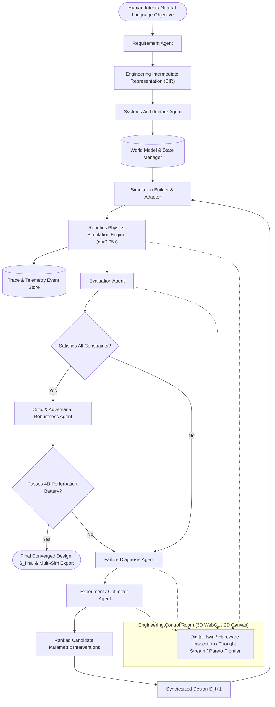
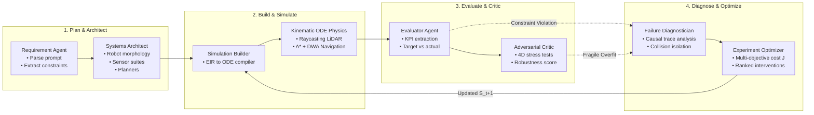

# SimWeaver: Autonomous Multi-Agent Robotics Simulation Engineer

[](https://simweaver.vercel.app)
[](https://simweaver-api.onrender.com/api/health)
[](wss://simweaver-api.onrender.com/ws/simulation)
[](LICENSE)

SimWeaver is an autonomous multi-agent simulation engineering platform designed to bridge natural language human engineering intent and formal, physically verified robotics simulation environments. Rather than simply generating static simulator code from a prompt, SimWeaver conducts the complete iterative engineering lifecycle: it parses human requirements into a strongly typed Executable Intermediate Representation (EIR), builds continuous ODE kinematic physics environments ($\Delta t = 0.05\text{s}$), evaluates high-resolution telemetry against formal quantitative constraints, performs causal trace diagnosis on failure events, formulates and ranks candidate parametric interventions, subjects solutions to adversarial 4D perturbation stress tests via a Critic agent, and iterates autonomously until multi-robot coordination converges.

---

## Live Production Endpoints

- **Interactive Control Room (Vercel Global CDN):** [https://simweaver.vercel.app](https://simweaver.vercel.app)
  - Direct Production Alias: [https://simweaver-omega.vercel.app](https://simweaver-omega.vercel.app)
- **Robotics Simulation API (Render Dedicated Web Service):** [https://simweaver-api.onrender.com](https://simweaver-api.onrender.com)
  - Health Check: `https://simweaver-api.onrender.com/api/health` (HTTP 200 OK)
  - Duplex Telemetry WebSockets: `wss://simweaver-api.onrender.com/ws/simulation`
- **GitHub Repository:** [https://github.com/Erebuzzz/SimWeaver.git](https://github.com/Erebuzzz/SimWeaver.git)

---

## 1. System Design & Architecture

SimWeaver is organized around a decoupled, simulator-independent architecture. Agents reason over high-level robotics concepts in the **Engineering Intermediate Representation (EIR)**, while deterministic execution engines perform continuous numerical physics integration, raycasting, and metric calculation.



---

## 2. Multi-Agent Reasoning Loop

SimWeaver coordinates 7 specialized agent roles working across formal engineering stages:



| Agent | Core Responsibility | Input | Output |
|---|---|---|---|
| **Requirement Agent** | Parses unstructured prompt into formal constraints, objectives, and metric targets | User Prompt | Structured Constraints & Objectives |
| **Systems Architect** | Synthesizes baseline AMR morphology, sensor suite, planner, and coordination stack | Requirements | Initial Design $S_0$ + Rationale |
| **Simulation Builder** | Compiles EIR into executable continuous simulation instances | EIR Design $S_t$ | Continuous Physics ODE Environment |
| **Evaluation Agent** | Synthesizes telemetry traces into standardized KPI verification tables | Simulation Traces | Target vs Actual Metrics Table |
| **Failure Diagnosis Agent** | Causal trace analysis to isolate bottlenecks, near-misses, and collision hot-spots | Collision & Near-Miss Traces | Causal Diagnosis Hypothesis |
| **Experiment Optimizer** | Generates, predicts trade-offs, and ranks candidate engineering interventions | Diagnosis + Lineage | Ranked Interventions + Design $S_{t+1}$ |
| **Adversarial Critic** | Stress-tests designs against environmental perturbations to prevent overfitting | Nominal Solution | Robustness Index (0 to 100%) |

### Mathematical Multi-Objective Optimization Formulation

The Experiment Optimizer evaluates candidate modifications using a composite multi-objective cost function $J$:

$$J(S_t) = w_c \cdot C + w_t \cdot \bar{T} + w_r \cdot (1 - R) + w_s \cdot \max(0, d_{\text{safe}} - d_{\text{min}})$$

Where:
- $C$: Total collision count across simulation horizon ($w_c = 100.0$)
- $\bar{T}$: Average package delivery time in seconds ($w_t = 0.05$)
- $R$: Task completion rate ($w_r = 10.0$)
- $d_{\text{safe}} - d_{\text{min}}$: Safety separation deficit in meters ($w_s = 20.0$)

---

## 3. Engineering Intermediate Representation (EIR)

The EIR is a typed, simulator-independent Pydantic schema encompassing environment geometry, robot kinematic properties, sensor configurations, navigation planners, and safety constraints:

```yaml
id: eir_iter_2
version: 1.0.0
iteration: 2
name: SimWeaver Warehouse System Design
human_intent: Warehouse multi-robot delivery with zero collisions and high throughput.

environment:
  name: Warehouse Standard
  width: 24.0
  height: 16.0
  grid_resolution: 0.25
  aisle_width: 2.0

robot:
  type: differential_drive
  count: 5
  radius: 0.28
  wheel_base: 0.40
  mass: 25.0
  max_linear_speed: 1.2
  max_angular_speed: 2.0
  max_linear_accel: 1.5
  max_angular_accel: 3.0

sensors:
  lidar_enabled: true
  lidar_range: 8.0
  lidar_fov_deg: 360.0
  lidar_rays: 720
  lidar_noise_std: 0.01

planner:
  global_planner: astar
  local_planner: dwa
  dwa_sim_time: 1.5
  dwa_heading_weight: 0.40
  dwa_clearance_weight: 0.45
  dwa_velocity_weight: 0.25
  safety_margin: 0.35
  goal_tolerance: 0.35

coordination:
  protocol: intersection_reservation
  intersection_reservation_radius: 1.8
  yield_timeout_sec: 2.0
  dynamic_safety_radius: true
  speed_in_intersection: 0.60

constraints:
  max_allowed_collisions: 0
  max_delivery_time_sec: 60.0
  min_separation_m: 0.30
  min_completion_rate: 0.95
  max_near_misses: 5
```

---

## 4. Continuous Physics ODE & Perception Engine

- **Continuous 2D Kinematics and Dynamics**: Step integration ($\Delta t = 0.05\text{s}$), acceleration boundaries, and inertia modeling.
- **Physical Intensity-Driven LiDAR**: Ray-polygon and ray-circle intersections with inverse square $1/r^2$ radiance attenuation modeling and obstacle reflection sparks.
- **Global Path Planning (A*)**: Discretized grid planning with diagonal 8-connectivity, obstacle inflation buffers, and line-of-sight waypoint smoothing.
- **Local Reactive Controller (DWA)**: Dynamic Window velocity sampling optimizing heading progress, obstacle clearance, and speed profile.
- **Traffic Coordination**: Spatial-temporal intersection reservation manager granting mutual exclusion tokens to eliminate crossing deadlocks.
- **Continuous Collision Detection**: High-frequency robot-to-robot and robot-to-shelf distance checks with microsecond collision event timestamps.

---

## 5. 3D Digital Twin & Explodify Hardware Inspection

The frontend includes an interactive Three.js WebGL viewport allowing detailed hardware inspection:
- **Solid Mode**: Production matte titanium chassis with status LED rings and intensity LiDAR radiance.
- **Explodify Mode**: Smooth kinematic explosion animation separating LiDAR dome ($+1.6\text{m}$), compute motherboard ($+1.0\text{m}$), LiFePO4 battery ($+0.4\text{m}$), brushless drive motors, and chassis.
- **X-Ray Mode**: Translucent holographic wireframe exposing internal subsystems and power routing.
- **Subsystem Inspection**: Real-time telemetry inspect bar for LiDAR, Jetson Compute, 24V Battery, Drive Motors, and Structural Chassis.

---

## 6. 24/7 Zero-Cold-Start Keep-Alive Automation

To eliminate Render free-tier idle shutdowns (where services sleep after 15 minutes of inactivity), SimWeaver deploys a dual keep-alive mechanism:
1. **Internal FastAPI Lifespan Self-Ping** ([app.py](file:///d:/SimWeave/simweaver/server/app.py)): Automatically detects `RENDER_EXTERNAL_URL` and issues an asynchronous HTTP GET to `/api/health` every 10 minutes (600s).
2. **GitHub Actions Scheduled Cron** ([.github/workflows/keep_alive.yml](file:///d:/SimWeave/.github/workflows/keep_alive.yml)): Fires every 10 minutes on GitHub's free runners (`*/10 * * * *`) dispatching external heartbeats.

---

## 7. Model Context Protocol (MCP) Integration

SimWeaver can be managed autonomously via MCP from compatible AI assistants (Gemini, Claude, Cursor, Codex):

```json
{
  "mcpServers": {
    "vercel": {
      "command": "npx",
      "args": ["-y", "mcp-remote", "https://mcp.vercel.com"]
    },
    "render": {
      "command": "npx",
      "args": [
        "-y",
        "mcp-remote",
        "https://mcp.render.com/mcp",
        "--header",
        "Authorization: Bearer YOUR_RENDER_API_KEY"
      ],
      "env": {
        "RENDER_API_KEY": "YOUR_RENDER_API_KEY"
      }
    }
  }
}
```

---

## 8. Multi-Simulator Code Synthesis

When a robotics system satisfies all constraints and passes the Critic perturbation tests, SimWeaver exports the converged specification into native simulator packages:
- **ROS 2 Nav2**: Full Python launch package with DWA local planner parameters, costmap inflation layers, and lifecycle nodes.
- **Webots**: Complete `.wbt` world file with solid physics nodes, differential wheels, and distance sensor slots.
- **URDF**: Standard XML Robot Description Format specifying links, continuous revolute joints, and inertial tensors.
- **PyBullet**: Standalone Python physics script ready for headless reinforcement learning or hardware-in-the-loop benchmarking.
- **Engineering Audit Report**: Markdown compliance documentation detailing requirement verification matrices and iteration Pareto frontiers.

---

## 9. Project Structure

```
d:\SimWeave/
├── .github/
│   └── workflows/
│       └── keep_alive.yml        # 24/7 Render keep-alive cron workflow
├── simweaver/
│   ├── core/
│   │   ├── eir_models.py         # Pydantic EIR models and validation
│   │   └── world_model.py        # Centralized state and experiment lineage
│   ├── simulation/
│   │   ├── engine.py             # Continuous kinematic simulation engine
│   │   ├── planners.py           # A*, DWA, Pure Pursuit, Reservation Manager
│   │   └── telemetry.py          # High-resolution telemetry & event logger
│   ├── agents/
│   │   ├── llm_client.py         # Unified LLM + intelligent robotics reasoning
│   │   ├── requirement_agent.py  # Intent -> formal constraint parsing
│   │   ├── systems_architect.py  # Baseline architecture synthesis
│   │   ├── simulation_builder.py # EIR -> simulation runtime compiler
│   │   ├── evaluator.py          # KPI metrics extraction
│   │   ├── diagnostician.py      # Causal trace analysis & root cause isolation
│   │   ├── optimizer.py          # Candidate intervention generator & ranking
│   │   ├── critic.py             # 4-dimensional adversarial stress tester
│   │   └── orchestrator.py       # Autonomous optimization loop controller
│   └── server/
│       └── app.py                # FastAPI REST & WebSocket streaming server
├── frontend/
│   ├── src/
│   │   ├── components/           # Control room UI components & 3D viewers
│   │   ├── config.ts             # Dynamic API & WebSocket client resolver
│   │   ├── types.ts              # TypeScript interfaces
│   │   ├── App.tsx               # Main application layout
│   │   └── main.tsx              # React entrypoint
│   ├── package.json
│   ├── vercel.json               # Vercel SPA rewrites
│   ├── vite.config.ts
│   └── tailwind.config.js
├── tests/
│   ├── test_eir.py               # EIR schema & cost tests
│   ├── test_simulation.py        # Planner & physics tests
│   ├── test_agents.py            # Multi-agent loop tests
│   └── test_server.py            # FastAPI REST & WebSocket tests
├── render.yaml                   # 1-click Render web service deployment blueprint
├── Dockerfile                    # Container definition
├── Procfile                      # Process configuration
├── run_tests.py                  # Test suite runner
├── requirements.txt              # Python dependencies
├── .gitignore                    # Git ignore rules
└── README.md                     # Comprehensive documentation
```

---

## 10. Quickstart Guide

### Prerequisites
- Python 3.10+
- Node.js 18+ and npm

### 1. Install Backend Dependencies
```bash
pip install -r requirements.txt
```

### 2. Install Frontend Dependencies
```bash
cd frontend
npm install
cd ..
```

### 3. Run Automated Test Suite
```bash
python -m pytest -p no:hypothesis tests/test_eir.py tests/test_simulation.py
```

### 4. Start Full Platform Locally
```bash
python start_simweaver.py
```

Open your browser at `http://localhost:5173` to access the local SimWeaver Engineering Control Room, or visit the live production deployment at **[https://simweaver.vercel.app](https://simweaver.vercel.app)**.
